# Walkthrough

In this article, we will walk you through the BitcartCC admin panel user interface and show you how to navigate through different options.

When creating an account, if you're the first user registered on the instance, you'll granted superuser rights\(full control over the server\). On third-party hosts it usually not so, but if you're hosting your own instance you'll of course become the full owner of it.

After you created the account on the BitcartCC instance hosted by yourself or a third-party, you'll see a lot of information cards.

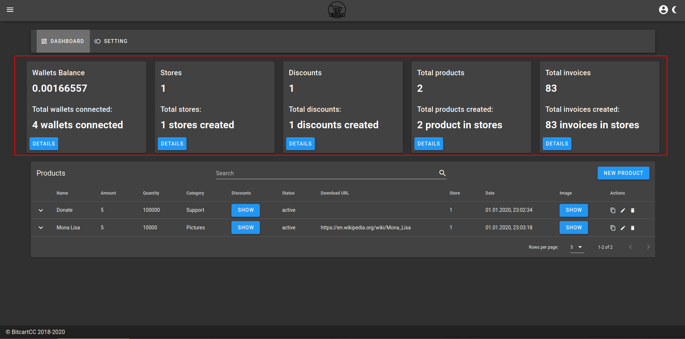

Note about the night mode of the panel. By default, admin panel uses day mode, but if in your local time it is from 8 pm to 6 am, night mode will be enabled automatically 😉 You can configure it by clicking the moon icon in the top right corner of the page.

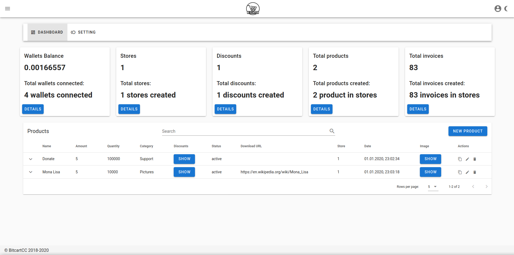

Each information card contains summary about something in your account: wallets, stores, products, invoices, etc.

By clicking Details button in any of the cards you will be able to see full information about specific unit.

Note, wallets balance is displayed not in BTC, but in abstract currency. It is a sum of all your balances in different currencies.

If you're a superuser, you can click on profile icon in the top right corner of the page to visit server settings page.

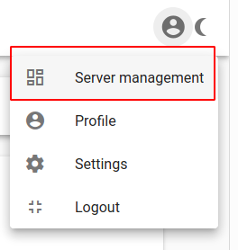

From server settings page, you can control the users of your server, and many more. For more information, check Server Settings FAQ

Now, to the other common settings.

Each page basically contains one common thing - a datatable.

It is a feature-rich datatable, supporting searching, ordering, create/edit/delete actions, and some additional actions depending on what page you're on. For example,  on stores page, you can configure email settings for a store by clicking email icon in actions column.  

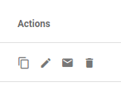

## Wallets

The core of BitcartCC is creating a wallet. In BitcartCC, one wallet represents one currency.

Default currency is btc, you can change that. When creating wallet, just type in the currency code\(btc,ltc etc.\) in currency field. Wallets may have a name and their xpub.

The nice feature of BitcartCC is that it does not require your private keys, but it supports many different formats.

You can enter \(x/y/z\)pub - public key, \(x/y/z\)prv - private key, or even electrum seed - providing easiest migration possible from many wallets, especially electrum. If you don't have an xpub yet, we recommend you create a wallet somewhere. [Electrum](https://electrum.org) wallet provides the best integration with BitcartCC, check Architecture page for more information.

When creating a wallet, it will get synced very fast\(depends on the size of the wallet, but shoudn't take too long\), and BitcartCC will fetch it's balance and display it.

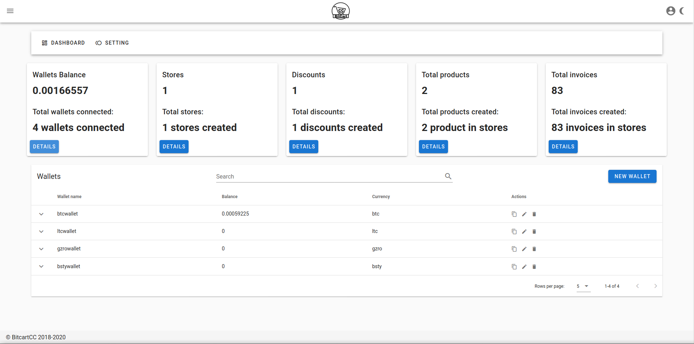

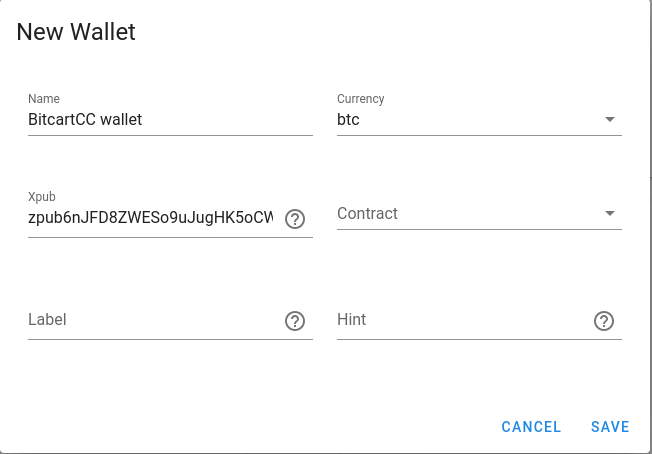

By clicking arrow near any of the rows, you can view some additional details, like wallet xpub.

## Stores

You can create unlimited amount of stores in BitcartCC.

Each store can contain any amount of products and associated invoices. Store is a base entrypoint for anything related to checkout.

Store may have multiple wallets connected. That way, connecting different wallets with different base currencies, you can achieve multicurrency checkout. 

Selecting multiple wallets of the same currency is **NOT** recommended. On invoice creation, BitcartCC will pick the first wallet of that currency, returned by database\(they might be returned in any order\).

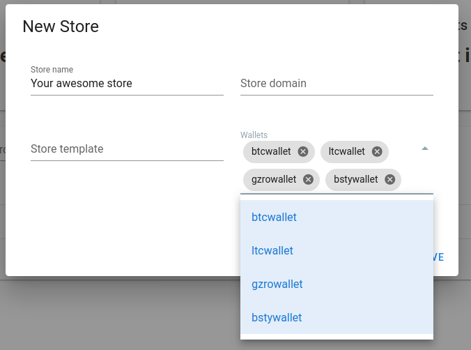

If you want to send customers invoices on successful checkout, you should configure email server.

To do that, click on email icon in actions column, and enter SMTP server details.

Store email is the email used to send messages from, and the display email in BitcartCC POS store.

Email host, port, login and password are credentials for your SMTP server. Email host shoudn't include any http:// or https:// parts. If your SMTP server requires TLS, turn on SSL/TLS switch.

When done\(you should click save button first\), click on Test ping button to see if your setup is working.

Note for gmail SMTP servers, you should enable access by turning on [less secure apps](https://myaccount.google.com/lesssecureapps)\(it is still secure, gmail apps aren't the requirement\). You might also need to [allow access](https://accounts.google.com/DisplayUnlockCaptcha) on a new account.

## Discounts

It is optional page for your initial setup, you may skip it for now.

In many cases you might want to add some discounts to your store. New year discounts, other holidays? Limited time promocode discounts? Discount when paying in your preferred currency? Anything is possible with BitcartCC.

Just provide a percent\(integer\) for your discount, and discount apply conditions: 

* promocode\(optional, when not provided discount is always applied when other conditions succeed\)
* end date
* currencies\(comma separated list of currency to apply to, or empty to apply to all currencies\)

You can link discounts to products in the products page.

When one invoice at creation time has matched multiple discounts, BitcartCC will pick the best discount\(by percent\).

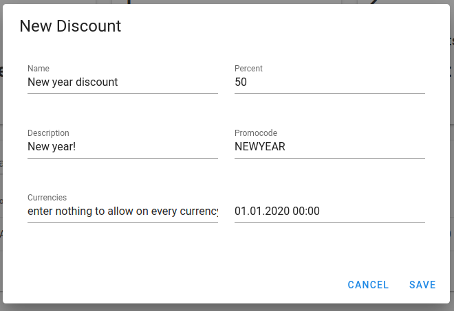

## Products

Products are your base selling unit. Create your products, link them to your stores, add product details - and they will get displayed in your store POS! 

BitcartCC supports many different information for creating products: 

* Amount, displayed in store POS in USD
* quantity\(how many products of the same kind available\)
* product category\(used for filtering in store POS to classify your products\)
* Discounts applied to the product\(see previous section\)
* Product status\(like in stock, not available, up to you\)
* Download url\(for digital content, will be sent to customer in email\)
* Store, from which to take wallets and other information
* Date of creation\(auto-filled\)
* Product image\(supports cropping, rotating and many more!\)
* Product description

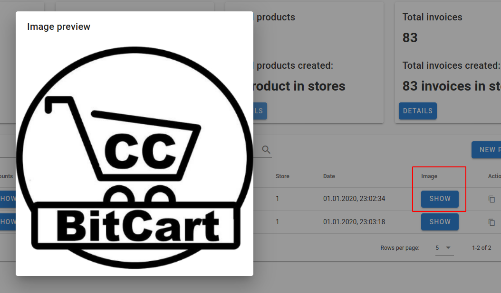

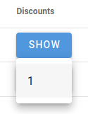

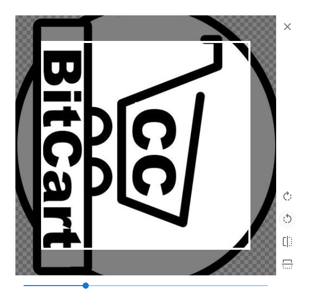

## Invoices

This page can be used to monitor your paid invoices, create new invoices and send them to friends, or to pay an invoice.

Supported information:

* Amount is amount in currency unit\(BTC, LTC, etc.\) which will be used to generate invoice
* Store, from which to take wallets and other information
* Connected products\(for store POS, optional\)
* Promocode, if customer entered it during checkout process\(auto-filled\)
* Notification URL where to send IPN notifications on invoice status change\(more below\)
* Redirect URL, customer will be redirected to it after successful checkout.
* Buyer email, if customer entered it during checkout process\(auto-filled\)
* Order ID, used by external integrations like woocommerce, track your orders by searching for order id\(auto-filled\)
* Discount - ID of the discount applied during invoice creation\(auto-filled\)
* Invoice status, more below
* Date of creation\(auto-filled\)
* Payment methods - not editable fields, displaying checkout information

If your invoice contains connected products, you'll be able to know which products were bought by the customer. The name of the first connected product will be used on checkout, or words "QR code" otherwise.

Amount will be the same for every payment method, so if you enter 5 as amount, it'll create payment methods for example for 5 BTC, 5 LTC and 5 GZRO. Take that in mind when creating a new invoice. This might be changed in future.

If you fill in notification URL, BitcartCC instance will send IPN notifications to that URL via a POST request.

It will send the following json data:

`{"id": invoice_id, "status": new_status}`

When invoice status changes\(Pending-&gt;complete, Pending-&gt;expired, etc.\), notification will be sent.

It's up to you how to process that IPN notification. You should also verify that data sent is corrected, as theoretically, anyone can send that POST request if they know your IPN handler URL. So, check that sent status is the same as the one got from get invoice request.

Invoices statuses can be one of the following:

* Pending\(in progress\)
* complete\(invoice paid\)
* invalid\(unexpected error\)
* expired
* In progress\(lightning network status\)
* Failed\(lightning network status\)

After invoice creation, you'll be able to view checkout information by clicking show button in payment methods column. It will display a so-called "invoice preview", it is not a fully functional checkout, but just an information dialog to display payment methods\(it ignores invoice status\).

By clicking open checkout you'll be redirected to full checkout, respecting invoice statuses and other things. Invoice url can be safely shared with others and used for checkout right from your admin panel.

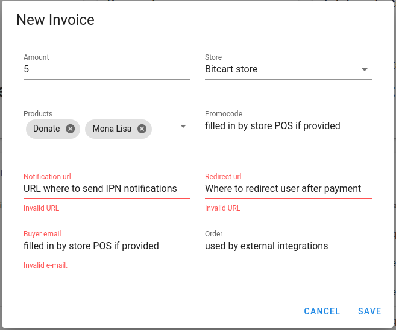

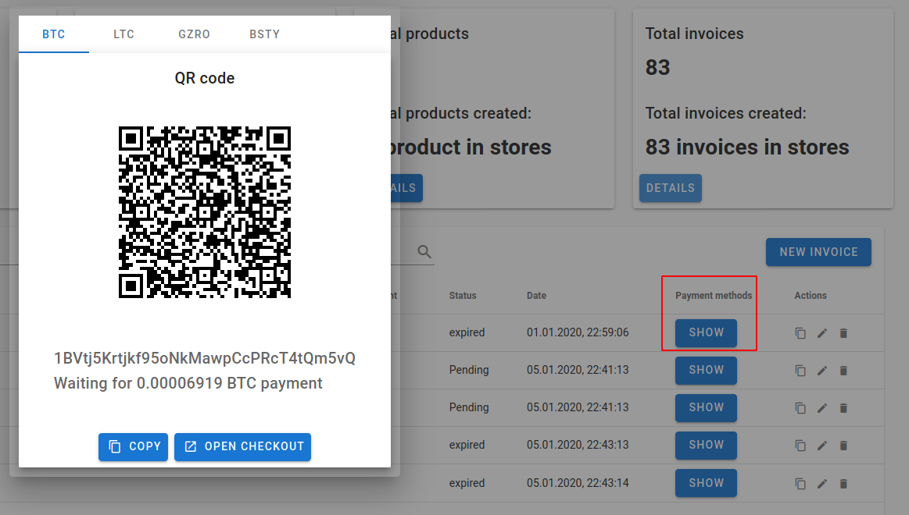

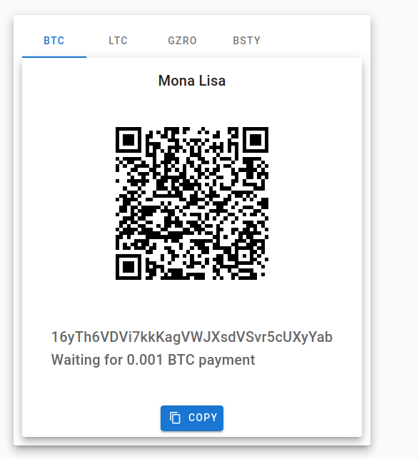

