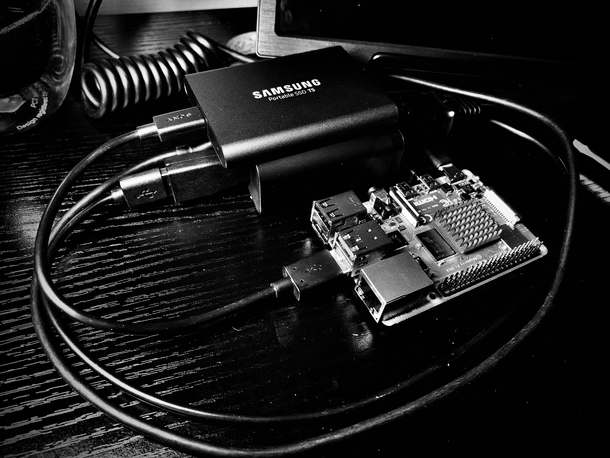
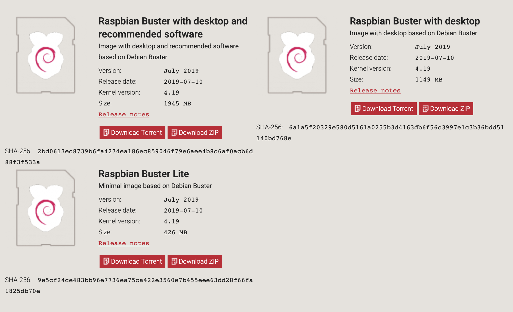

# Raspberry Pi 4 Deployment

This document guides you step by step on how to run BitcartCC on a Raspberry Pi 4. See here the [Raspberry Pi 3 instructions](rpi3.md)

The newly released Raspberry Pi 4 is currently the best low-cost single-board computer available. You can use a Raspberry Pi 4 to run your BitcartCC at home for around $130 worth of parts, described below.

## Required Hardware <a id="required-hardware"></a>

### Raspberry Pi 4 <a id="raspberry-pi-4"></a>

* ​[Raspberry Pi 4 with **2GB RAM**](https://www.canakit.com/raspberry-pi-4-2gb.html) \($45\)
* ​[Sandisk 16GB SD Card](https://www.amazon.com/dp/B073K14CVB/) \($5\)

You can use 1GB RAM or 4GB RAM versions too, it's up to you to pick your configuration. The 2GB RAM build is the golden middle between minimal and the best requirements. You’ll also need an **SD card reader** if you don’t already have one.

### Power Adapters and USB-C Cable <a id="power-adapters-and-usb-c-cable"></a>

* ​[Official Raspberry Pi 4 USB-C Power Adapter 5.1V/3A for US](https://shop.pimoroni.com/products/raspberry-pi-official-usb-c-power-supply-us?variant=29391144648787) \($10\)
* ​[Official Raspberry Pi 4 USB-C Power Adapter 5.1V/3A for EU](https://shop.pimoroni.com/products/raspberry-pi-official-usb-c-power-supply-eu?variant=29391130624083) \($10\)
* ​[Official Raspberry Pi 4 USB-C Power Adapter 5.1V/3A for AU](https://shop.pimoroni.com/products/raspberry-pi-official-usb-c-power-supply-au?variant=29391160737875) \($10\)

Don’t waste your time with random Chinese power adapters from Amazon, or expect that the existing ones you have at home are going to work fine. The Raspberry Pi 4 has issues with unofficial adapters, and for only $10 it’s better to just **get an official adapter** instead of learning this the hard way.

### Cooling options: Passive vs Active vs Passive+Active <a id="cooling-options-passive-vs-active-vs-passive-active"></a>

* ​[Pimoroni Fan Shim](https://shop.pimoroni.com/products/fan-shim) \($10\)

Strictly speaking, you don’t actually **need** a cooling solution, but you certainly **want** a cooling solution, because if the Raspberry PI core temperature reaches 70C, it will throttle the CPU down to avoid burning itself up.

### Case options: Naked vs. Protection <a id="case-options-naked-vs-protection"></a>

* ​[Flirc Heatsink Case](https://flirc.tv/more/raspberry-pi-4-case) \($12\)
* ​[Pimoroni Pibow Coupé 4](https://shop.pimoroni.com/products/pibow-coupe-4?variant=29210100105299) \($9\)

Of course, using a case is totally optional, but we recommend one to protect your Raspberry Pi over the long-term and prevent random dust from shorting out the pins.

### Data storage options: SSD vs USB memory vs SD card <a id="data-storage-options-ssd-vs-usb-memory-vs-sd-card"></a>

* ​[Samsung 250GB SSD](https://www.amazon.com/dp/B073H552FK) \($75\)

The 250GB SSD allows you to keep BitcartCC up and running forever plus anything else you might want to do on your Pi. The performance will be amazing. Actually you don't need a lot of disk space, only 10 GB is actually required, so pick your own components, depending on what do you want to do.

### Display options: Display or Headless <a id="display-options-display-or-headless"></a>

* Display \($100\)

## Assembling the Raspberry Pi 4 components <a id="assembling-the-raspberry-pi-4-components"></a>

* Important: Attach a heatsink to the CPU! 🔥🔥🔥
* Connect the SSD to one of the blue colored USB 3 ports
* Prepare the USB Power Adapter but don’t plug it in yet



## Install Linux on the Raspberry Pi <a id="install-linux-on-the-raspberry-pi"></a>

Start by downloading [Raspbian Linux](https://www.raspberrypi.org/downloads/raspbian/) to your existing computer. The “Lite” distribution is fine for BitcartCC setup, but if you want to use your Raspberry Pi for other things, you might want the full image.



### Flash your SD card with Raspbian Linux <a id="flash-your-sd-card-with-raspbian-linux"></a>

* Extract the downloaded Raspbian Linux zip file
* Download the latest version of [balenaEtcher](https://www.balena.io/etcher/) and install it.
* Connect an SD card reader with the SD card inside.
* Open balenaEtcher and select from your hard drive the Raspberry Pi .img from the extracted zip file you wish to write to the SD card.
* Select the SD card you wish to write your image to.
* Review your selections and click 'Flash!' to begin writing data to the SD card.

You can find a more in-depth instruction guide to flashing to your SD card at the [official Raspberry Pi website](https://www.raspberrypi.org/documentation/installation/installing-images).

If you used balenaEtcher to flash, the SD card will already have been ejected. Simply take the SD card out and put it back in. The SD card should now be labelled as `boot`. Next, enable SSH at bootup so you can remotely login by creating an empty file in the SD card root folder called `ssh`. Eject the SD card through your OS before taking it out of the SD card reader.


## Booting up the Raspberry Pi <a id="booting-up-the-raspberry-pi"></a>

After inserting the SD card into the Raspberry Pi, go ahead and connect the power and ethernet, and optionally the display and keyboard if you have those. It should boot up and get an IP address using DHCP. You can try searching for it with `ping raspberrypi.local` on your desktop PC, but if that doesn’t work you will need to login to your router to find its IP address.

The IP address that my Raspberry Pi got was 192.168.1.5 so I SSH’d to that:

```bash
ssh 192.168.1.5 -l pi
```

The default password for the “pi” user is “raspberry”. After SSH’ing in, the first thing I want to do is check the device’s CPU temperature to make sure the cooling system are working correctly:

```bash
sudo -svcgencmd measure_temp
```

Next, let’s change the password for the “pi” user:

```bash
passwd pi
```


After that, switch to the `root` user, which we will use for the remaining part of the tutorial:

```bash
sudo su -
```

## Configuring the storage <a id="configuring-the-storage"></a>

We recommend to disable swap to prevent burning out your SD card:

```bash
dphys-swapfile swapoff
dphys-swapfile uninstall
update-rc.d dphys-swapfile remove
systemctl disable dphys-swapfile
```


Partition your SSD:

```bash
fdisk /dev/sda
# type 'p' to list existing partitions
# type 'd' to delete currently selected partitions
# type 'n' to create a new partition
# type 'w' to write the new partition table and exit fdisk
```

Format the new partition on your SSD:

```bash
mkfs.ext4 /dev/sda1
```

Configure the SSD partition to auto-mount at bootup:

```bash
mkfs.ext4 /dev/sda1
mkdir /mnt/usb
UUID="$(sudo blkid -s UUID -o value /dev/sda1)"
echo "UUID=$UUID /mnt/usb ext4 defaults,noatime,nofail 0" | sudo tee -a /etc/fstab
mount -a
```

While you’re editing `/etc/fstab` add a RAM filesystem for logs \(optional\). This is also to prevent burning out your SD card too quickly:

```bash
echo 'none        /var/log        tmpfs   size=10M,noatime         00' >> /etc/fstab
```

Mount the SSD partition and create a symlink for docker to use the SSD:

```bash
mkdir /mnt/usb/docker
ln -s /mnt/usb/docker /var/lib/docker
```

## Configuring the firewall <a id="configuring-the-firewall"></a>

Upgrade your OS packages to the latest versions:

```bash
apt update && apt upgrade -y && apt autoremove
```

Install a firewall and allow SSH, HTTP, HTTPS:

```bash
apt install -y ufw
ufw default deny incoming
ufw default allow outgoing
```

This command allows SSH connections from internal networks only:

```bash
ufw allow from 10.0.0.0/8 to any port 22 proto tcp
ufw allow from 172.16.0.0/12 to any port 22 proto tcp
ufw allow from 192.168.0.0/16 to any port 22 proto tcp
ufw allow from 169.254.0.0/16 to any port 22 proto tcp
ufw allow from fc00::/7 to any port 22 proto tcp
ufw allow from fe80::/10 to any port 22 proto tcp
ufw allow from ff00::/8 to any port 22 proto tcp
```

These ports need to be accessible from anywhere \(The default subnet is 'any' unless you specify one\):

```bash
ufw allow 80/tcp
ufw allow 443/tcp
```

Verify your configuration:

```bash
ufw status
```

Enable your firewall:

```bash
ufw enable
```

## Setup BitcartCC <a id="setup-bitcartcc"></a>

Download BitcartCC from GitHub:

```bash
cd # ensure we are in root home
apt install -y fail2ban git
git clone https://github.com/bitcartcc/bitcart-docker
cd bitcart-docker
```

Configure BitcartCC by setting some environment variables:

```bash
export BITCART_HOST="api.raspberrypi.local"
export BITCART_ADMIN_HOST="admin.raspberrypi.local"
export BITCART_STORE_HOST="raspberrypi.local"
export BITCART_STORE_URL="http://api.raspberrypi.local"
export BITCART_ADMIN_URL="http://api.raspberrypi.local"
export BITCART_REVERSEPROXY="nginx"
export BTC_LIGHTNING=true
```

In case you want to restrict access to your local network only, please note that you need to use a `.local` domain.

Run the BitcartCC installation:

```bash
./setup.sh
./start.sh
```

It should be up and running within a few minutes. Try opening [http://admin.raspberrypi.local](http://admin.raspberrypi.local) in your web browser. If everything is correct, you will see BitcartCC front page.

