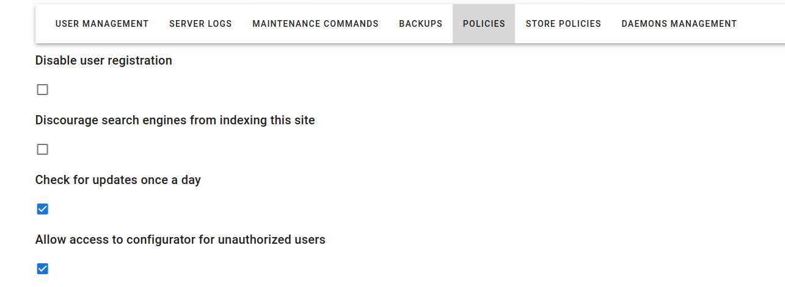

# Third-Party Hosting

A third-party host is someone who runs Bitcart instance and enables registration for other users. They might be free (but could accept donations) or with paid access.

Sometimes it's hard for users to deploy a new instance, but they want to try right away. That's what third-party hosts are for.&#x20;

In general, it's not recommended to use them especially if you plan to scale your business, but it's great for testing.

Our demo at https://admin.bitcart.ai showcases all coins Bitcart supports, but we don't recommend using it for commercial purposes.

There are some hosts ran by others

### List of third-party hosts

- [admin.bsty.business](https://admin.bsty.business) (BTC, BSTY, free)

### How do I get added to that list?

You can contact us in one of [our communities](https://bitcart.ai/#community). Your server should have enabled server registration in server management settings.

### What are the limitations of this?

The only limitation is that you won't be able to access server management pages. Other than that, it's pretty much the same unless server owner has forked Bitcart. Check [this guide](../guides/server-management-settings.md) for details on server management settings.

### Is it safe?

Well, in most cases yes, but you should be aware of scams! People might fork Bitcart and customize it to be malicious. We never intercept the payment process and never require a private key (except for lightning network). Also, watch your wallet to check if the host replaced your public key with their own! Some public hosts also handle a lot of customers of different services, so if you self-host one yours won't be that loaded.
