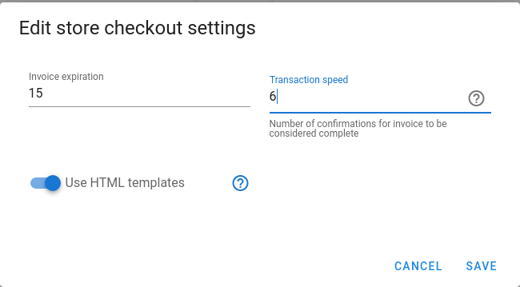

# Transaction speed

What does transaction speed mean?

First of all, transaction speed applies only to on-chain invoices. All lightning invoices are instantly marked as complete.

To understand why transaction speed setting is needed, you need to understand the invoice statuses in BitcartCC:

When invoice has just been created, it has `pending` status.

If no payment has been sent within the invoice time frame \(expiration time\), invoice is marked `expired`. Expired invoices no longer listen for incoming payments, but you may manually mark it complete.

If a payment has been sent within the invoice time frame \(expiration time\), invoice status is set to `paid`.

With `paid` status, customer is redirected to the redirect URL, and checkout page shows paid. But all the notifications, emails and custom scripts aren't executed yet.

When payment has been confirmed \(has &gt;= 1 confirmations\), invoice status is set to `confirmed`.

When payment's number of confirmations is &gt;= transaction speed, invoice status is set to `complete`, and all the postorder actions are executed \(like notifications\).

So, transaction speed controls how fast you want your invoice to be complete. Default value of 0 provides the fastest checkout, but it is not always good for your use case, it might be not safe. 

Value of 1 means waiting for one confirmation, which is enough in most cases.

You can set transaction speed to any value between 0 and 6 \(there is no point in waiting past 6 confirmations\).

